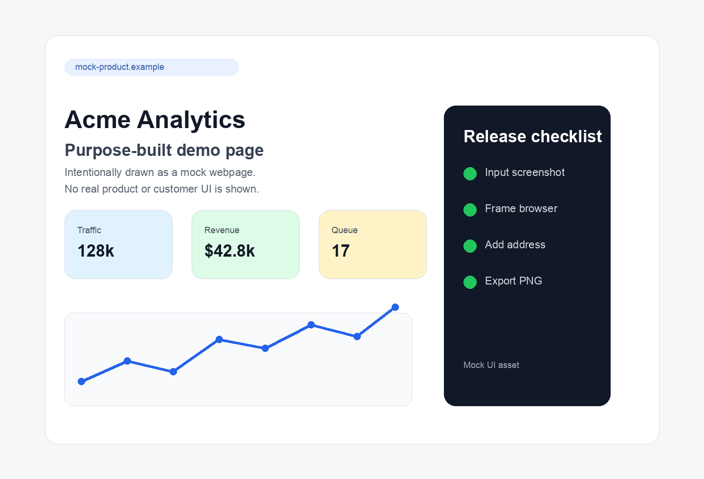
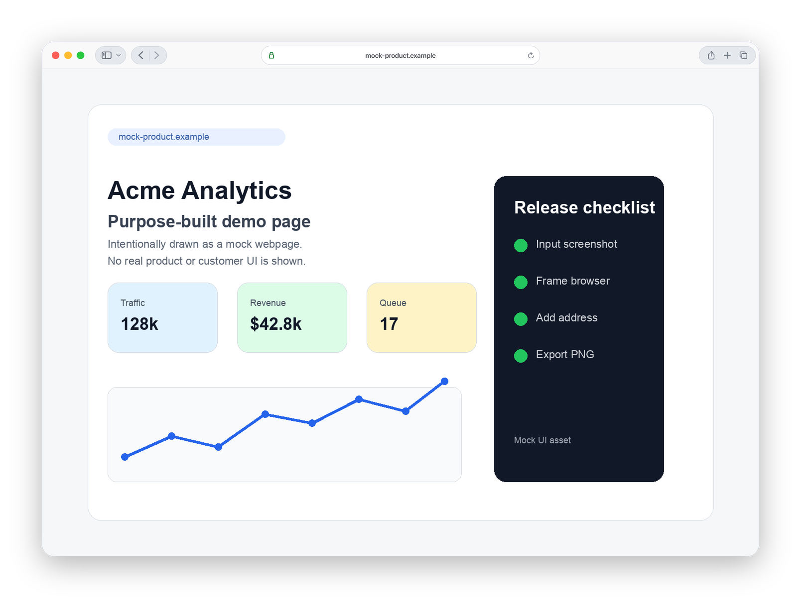
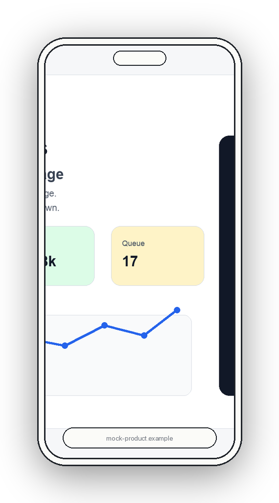

# BrowserShot

BrowserShot wraps one or more existing screenshots or UI mockups in generated Safari/macOS browser frames or iPhone frames.

It is useful when you already have an image of a webpage or product surface and want a polished browser/device presentation image without launching a browser.

## Input and Output

Input is one or more image files, usually PNG screenshots or exported mockups.

Output is a new PNG next to the input image unless `--output` is provided. BrowserShot never edits the source image in place.

Example:

```sh
./browsershot examples/mock-page.png --address mock-product.example --light
```

Produces:

```text
examples/mock-page.png.safari-realistic-light.png
```

## Examples

The `examples/mock-page.png` fixture is an intentionally fake webpage-style mockup generated for this repository. The framed screenshots below were produced with BrowserShot itself.



Desktop Safari frame:



iPhone frame:



## Usage

```sh
./browsershot <sourcefile> [sourcefile ...] --address my.addressbar-value.com --iphone --light --stylized
```

Common options:

- `--address <text>` sets the browser address bar text. The default is `example.com`.
- `--iphone` renders inside an iPhone frame instead of a desktop Safari window.
- `--light` uses light mode. Dark mode is the default.
- `--stylized` uses a simple line-drawing browser/device style. Realistic Safari chrome is the default.
- `--no-shadow` disables the outer browser/device shadow.
- `-o, --output <path>` writes to an explicit output path.

## Stacking Multiple Screenshots

When multiple source files are passed, BrowserShot stacks framed browsers with the first image on top.

```sh
./browsershot first.png second.png third.png --left 40 --top 24
./browsershot first.png second.png third.png --scale 5%
```

Defaults:

- stacked browsers default to `--right 80 --bottom 50`,
- `--scale <percent>` scales each background browser and stack offset down per stack level,
- when a stack offset axis is `0`, scaled background browsers are centered on that axis,
- `--left <px>` and `--right <px>` are mutually exclusive,
- `--top <px>` and `--bottom <px>` are mutually exclusive.

## Cropping Input Images

Masks crop source images before the browser frame is generated.

```sh
./browsershot --mask x:100 first.png second.png
./browsershot first.png --mask bottom:100px left:50%
./browsershot first.png --imask top:720px left:1280px
```

`--mask` removes the specified edge regions. `--imask` keeps the specified edge regions, so `--imask top:720px left:1280px` keeps the top 720px and left 1280px of the image.

If `--mask` or `--imask` appears before any source file, it applies to all source files. If it appears after a source file, it applies only to that source file.

Mask values can use bare pixels, `px`, or `%`. Supported mask keys are `top`, `right`, `bottom`, `left`, `x`, and `y`.

## Overlays and Cursors

```sh
./browsershot first.png second.png --overlay dragoverlay.png,400,250 --cursor 500,300
./browsershot first.png --overlay dragoverlay.png,400,250,50%
```

Final output is layered as back browser, middle browsers, top browser, overlays, then cursors.

Overlay and cursor coordinates are measured from the top-left corner of the actual top source image inside the browser, not from the full output canvas. Negative coordinates move the layer above or left of that source image. Overlays preserve transparency.

## Output Filename Pattern

Without `--output`, BrowserShot appends a descriptive suffix to the source file:

```text
image.png.safari-stylized-light.png
image.png.safari-realistic-dark.png
image.png.safari-iphone-stylized-light.png
image.png.safari-stack-realistic-dark.png
```

## License

BrowserShot is released under the MIT License. See [LICENSE](LICENSE).
